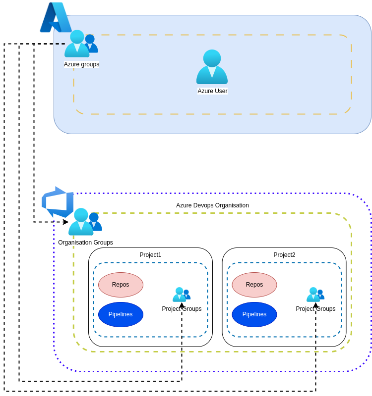

# Azure Devops

## Organization
This section defines everything related to Azure Devops groups:

* Defining groups of groups.
* Defining permissions for groups.
* Link between Azure Groups and Azure Devops Groups.
* How to assign members to a group.

To get an overview of Azure Devops groups, it is recommended to read the official [documentation](https://learn.microsoft.com/en-us/azure/devops/organizations/security/about-permissions?view=azure-devops&tabs=preview-page). This document will provide us with the necessary knowledge to know how to develop all the resources defined on this page:

* Groups.
* Members.
* Permissions.

### Groups
During the creation of the organisation and the project, a list of groups and associated permissions are created by default (it also adds a TEAM with the name of the project).

If possible and appropriate, we will use already defined groups. Before continuing, it is necessary to point out that currently two groups can be distinguished in the project: Group1 and Group2. The groups we will use are as follows:

* *[Organization level]* Project Collection Administrators. (Created by default).
* *[Project Level]* Project Administrators. (Created by default).
* *[Project Level]* Readers. (Created by default).
* *[Project Level]* Group1 Administrators. (Created on demand).
* *[Project Level]* Group2 Administrators. (Created on demand).

### Permissions Groups
Each group will have specific permissions over different areas of Azure Devops. The areas currently used are: repositories and pipelines.

#### Project Collection Administrators
Members in this group are administrators of the entire organisation. They can perform any action over the entire organisation.

#### Project Administrators
Members in this group are project administrators and read-only users at the organisation level (it is not possible to limit read permissions). They can perform actions such as:

* Set project configuration.
* All actions on the Repositories section.
* All actions on the Pipelines section.

#### Readers
Members in this group are read-only users at the organisation-wide level, even if this group is defined at project level.

#### Group1 Administrators
Members in this group are administrator users of Group1 resources only. This includes:
* Repositories for use in Group1.
* Group1 directory in Azure Pipelines.

#### Group2 Administrators
Members in this group are administrator users of Group2 resources only. This includes:
* Repositories for use in Group2.
* Group2 directory in Azure Pipelines.

*The Azure Pipelines folder structure will be visible to all members of the organisation, it is a behaviour that is not possible to change in Azure Devops.*

### Azure Groups
Azure Devops has integration with Azure Groups, and therefore we delegate the assignment of users to groups to this service. To establish a relationship between groups of different services is established by adding an Azure Groups group as a member of Azure Devops Groups. The groups defined in Azure Groups and the relationship they have with Azure Devops groups is as follows:

* Group-AzDevops-Org-Admin is a member of Project Collection Administrators.
* Group-AzDevops-Prj-Admin is a member of Project Administrators.
* Group-AzDevops-Prj-Reader is a member of Readers.
* Group-AzDevops-Group1-Admin is a member of Group1 Administrators.
* Group-AzDevops-Group2-Admin is a member of Group2 Administrators.
 
## Azure Repos
## Azure Pipelines
