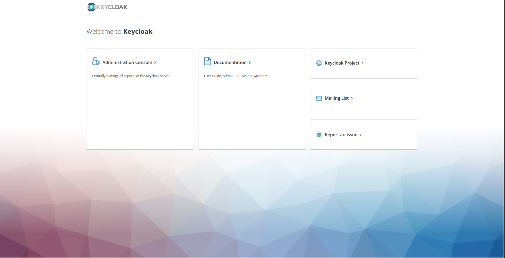
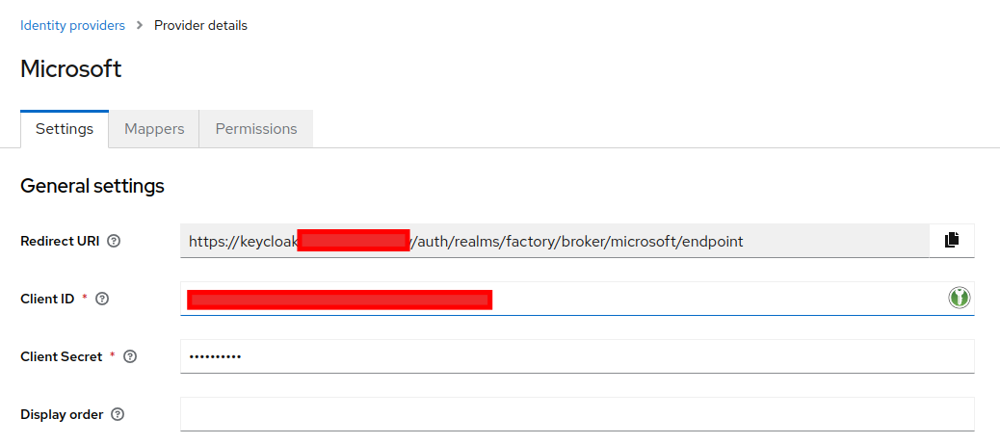

# Keycloak
Keycloak is an open source software product that enables single sign-on (IdP) with Identity Management and Access Management for modern applications and services. This software is written in Java and supports by default SAML v2 and OpenID Connect (OIDC) / OAuth2 identity federation protocols. It is licensed from Apache and is supported by Red Hat.

From a conceptual perspective, the intent of the tool is to facilitate the protection of applications and services with little or no encryption. An IdP allows an application (often called a Service Provider or SP) to delegate its authentication.

## Installation
We will install Keycloak on Kubernetes, for this we will use the official [Helm Chart](https://github.com/codecentric/helm-charts/tree/master/charts/keycloakx) for the new version of KeycloakX.

The Helm values we will use will be:
```yaml
# Ref: https://github.com/codecentric/helm-charts/blob/master/charts/keycloakx/values.yaml
command:
  - "/opt/keycloak/bin/kc.sh"
  - "--verbose"
  - "start"
  - "--http-enabled=true"
  - "--http-port=8080"
  - "--hostname-strict=false"
  - "--hostname-strict-https=false"
  - "--spi-events-listener-jboss-logging-success-level=info"
  - "--spi-events-listener-jboss-logging-error-level=warn"

extraEnv: |
  - name: KEYCLOAK_ADMIN
    valueFrom:
      secretKeyRef:
        name: {{ include "keycloak.fullname" . }}-admin-creds
        key: user
  
  - name: KEYCLOAK_ADMIN_PASSWORD
    valueFrom:
      secretKeyRef:
        name: {{ include "keycloak.fullname" . }}-admin-creds
        key: password

  - name: JAVA_OPTS_APPEND
    value: >-
      -XX:+UseContainerSupport
      -XX:MaxRAMPercentage=50.0
      -Djava.awt.headless=true
      -Djgroups.dns.query={{ include "keycloak.fullname" . }}-headless

ingress:
  enabled: true
  ingressClassName: "nginx"
  servicePort: http
  annotations:
    external-dns.alpha.kubernetes.io/hostname: keycloak.<your-domain>
    nginx.ingress.kubernetes.io/proxy-buffer-size: "128k"
  rules:
    - host: 'keycloak.<your-domain>'
      paths:
        - path: '{{ tpl .Values.http.relativePath $ | trimSuffix "/" }}/'
          pathType: Prefix

  console:
    enabled: true
    ingressClassName: "nginx"
    annotations:
      nginx.ingress.kubernetes.io/proxy-buffer-size: "128k"
    rules:
      - host: 'keycloak.<your-domain>'
        paths:
          - path: '{{ tpl .Values.http.relativePath $ | trimSuffix "/" }}/admin'
            pathType: Prefix

dbchecker:
  enabled: true

database:
    vendor: <database-vendor>
    hostname: <database-hostname>
    port: <database-port>
    database: <database-name>
    username: <database-username>
    password: <database-password>

secrets:
    admin-creds:
        stringData:
            user: <user>
            password: <password>
```

If you have a `realm.json` file with the configuration, you can optionally add:

```yaml
command:
  - "/opt/keycloak/bin/kc.sh"
  - "--verbose"
  - "start"
  # Add `--import-realm` flag
  # https://www.keycloak.org/server/importExport 
  - "--import-realm"
  - "--http-enabled=true"
  - "--http-port=8080"
  - "--hostname-strict=false"
  - "--hostname-strict-https=false"
  - "--spi-events-listener-jboss-logging-success-level=info"
  - "--spi-events-listener-jboss-logging-error-level=warn"

extraVolumes: |
  - name: {{ include "keycloak.fullname" . }}-realm
    secret:
      secretName: {{ include "keycloak.fullname" . }}-realm

extraVolumeMounts: |
  - name: {{ include "keycloak.fullname" . }}-realm
    mountPath: "/opt/keycloak/data/import/realm.json"
    readOnly: true
    subPath: realm.json

secrets:
    realm:
        stringData:
            realm.json: <realm-file> 
```



## Configure Microsoft Azure as Identity Provider

