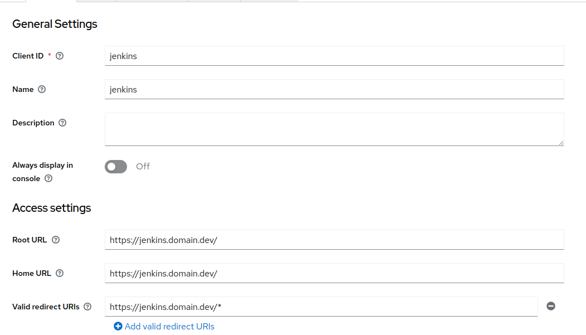

# Keycloak
Keycloak is an open source software product that enables single sign-on (IdP) with Identity Management and Access Management for modern applications and services. This software is written in Java and supports by default SAML v2 and OpenID Connect (OIDC) / OAuth2 identity federation protocols. It is licensed from Apache and is supported by Red Hat.

From a conceptual perspective, the intent of the tool is to facilitate the protection of applications and services with little or no encryption. An IdP allows an application (often called a Service Provider or SP) to delegate its authentication.

## Installation
We will install Keycloak on Kubernetes, for this we will use the official [Helm Chart](https://github.com/codecentric/helm-charts/tree/master/charts/keycloakx) for the new version of KeycloakX.

The Helm values we will use will be:
```yaml
# Ref: https://github.com/codecentric/helm-charts/blob/master/charts/keycloakx/values.yaml
command:
  - "/opt/keycloak/bin/kc.sh"
  - "--verbose"
  - "start"
  - "--http-enabled=true"
  - "--http-port=8080"
  - "--hostname-strict=false"
  - "--hostname-strict-https=false"
  - "--spi-events-listener-jboss-logging-success-level=info"
  - "--spi-events-listener-jboss-logging-error-level=warn"

extraEnv: |
  - name: KEYCLOAK_ADMIN
    valueFrom:
      secretKeyRef:
        name: {{ include "keycloak.fullname" . }}-admin-creds
        key: user
  
  - name: KEYCLOAK_ADMIN_PASSWORD
    valueFrom:
      secretKeyRef:
        name: {{ include "keycloak.fullname" . }}-admin-creds
        key: password

  - name: JAVA_OPTS_APPEND
    value: >-
      -XX:+UseContainerSupport
      -XX:MaxRAMPercentage=50.0
      -Djava.awt.headless=true
      -Djgroups.dns.query={{ include "keycloak.fullname" . }}-headless

ingress:
  enabled: true
  ingressClassName: "nginx"
  servicePort: http
  annotations:
    external-dns.alpha.kubernetes.io/hostname: keycloak.<your-domain>
    nginx.ingress.kubernetes.io/proxy-buffer-size: "128k"
  rules:
    - host: 'keycloak.<your-domain>'
      paths:
        - path: '{{ tpl .Values.http.relativePath $ | trimSuffix "/" }}/'
          pathType: Prefix

  console:
    enabled: true
    ingressClassName: "nginx"
    annotations:
      nginx.ingress.kubernetes.io/proxy-buffer-size: "128k"
    rules:
      - host: 'keycloak.<your-domain>'
        paths:
          - path: '{{ tpl .Values.http.relativePath $ | trimSuffix "/" }}/admin'
            pathType: Prefix

dbchecker:
  enabled: true

database:
    vendor: <database-vendor>
    hostname: <database-hostname>
    port: <database-port>
    database: <database-name>
    username: <database-username>
    password: <database-password>

secrets:
    admin-creds:
        stringData:
            user: <user>
            password: <password>
```

If you have a `realm.json` file with the configuration, you can optionally add:

```yaml
command:
  - "/opt/keycloak/bin/kc.sh"
  - "--verbose"
  - "start"
  # Add `--import-realm` flag
  # https://www.keycloak.org/server/importExport 
  - "--import-realm"
  - "--http-enabled=true"
  - "--http-port=8080"
  - "--hostname-strict=false"
  - "--hostname-strict-https=false"
  - "--spi-events-listener-jboss-logging-success-level=info"
  - "--spi-events-listener-jboss-logging-error-level=warn"

extraVolumes: |
  - name: {{ include "keycloak.fullname" . }}-realm
    secret:
      secretName: {{ include "keycloak.fullname" . }}-realm

extraVolumeMounts: |
  - name: {{ include "keycloak.fullname" . }}-realm
    mountPath: "/opt/keycloak/data/import/realm.json"
    readOnly: true
    subPath: realm.json

secrets:
    realm:
        stringData:
            realm.json: <realm-file> 
```

## Login


## Configure Microsoft Azure as Identity Provider
### App Registration
Create your Azure App Registration with the following config:


### Keycloak Indentity Provider
Create provider with the data for Azure App Registration.


## Integrations
### Jenkins
In this page we define the configuration for a correct integration between Jenkins and Keycloak.

#### Requirements
* [Jenkins 4.2.9](https://github.com/jenkinsci/helm-charts/tree/main/charts/jenkins)
* [keycloak:2.3.0](https://plugins.jenkins.io/keycloak/)
* [role-strategy:569.v7476f8e4fe29](https://plugins.jenkins.io/role-strategy/)

#### Configuration
First we will need to configure Keycloak. We will assume that we have a new Realm called **Factory**.

##### Keycloak
###### Clients
Create **jenkins** client.



###### Realm roles
Create Realm roles:

* **jenkins_administrators**
* **jenkins_readonly**


###### Groups
Create groups:

* **jenkins_administrators**
* **jenkins_readonly**


And assign **Role mapping** in each group. For example:


###### Users
Join user to a **jenkins_administrators** group.


##### Jenkins
At this point we define the necessary configuration in Jenkins to be able to perform the integration with Keycloak.

###### Download adapter config


###### Configuration
The YAML file for the Helm Chart is:
```yaml

controller:
  tag: "2.361.2"
  installPlugins:
    - locale:204.v2a_f305fe7e9d
    - pipeline-model-extensions:2.2118.v31fd5b_9944b_5
    - echarts-api:5.4.0-1
    - docker-workflow:528.v7c193a_0b_e67c
    - jaxb:2.3.7-1
    - snakeyaml-api:1.32-86.ve3f030a_75631
    - branch-api:2.1046.v0ca_37783ecc5
    - ssh-credentials:305.v8f4381501156
    - sshd:3.236.ved5e1b_cb_50b_2
    - jackson2-api:2.13.4.20221013-295.v8e29ea_354141
    - javax-activation-api:1.2.0-5
    - variant:59.vf075fe829ccb
    - structs:324.va_f5d6774f3a_d
    - popper2-api:2.11.6-2
    - pipeline-stage-tags-metadata:2.2118.v31fd5b_9944b_5
    - antisamy-markup-formatter:2.7
    - pipeline-utility-steps:2.13.0
    - workflow-aggregator:590.v6a_d052e5a_a_b_5
    - instance-identity:116.vf8f487400980
    - mailer:438.v02c7f0a_12fa_4
    - command-launcher:1.2
    - ace-editor:1.1
    - commons-text-api:1.10.0-27.vb_fa_3896786a_7
    - bouncycastle-api:2.26
    - jdk-tool:55.v1b_32b_6ca_f9ca
    - pipeline-model-api:2.2118.v31fd5b_9944b_5
    - junit:1153.v1c24f1a_d2553
    - ssh-slaves:2.854.v7fd446b_337c9
    - envinject:2.881.v37c62073ff97
    - pipeline-model-definition:2.2118.v31fd5b_9944b_5
    - rebuild:1.34
    - pipeline-groovy-lib:613.v9c41a_160233f
    - configuration-as-code:1559.v38a_b_2e3b_6b_b_7
    - commons-lang3-api:3.12.0-36.vd97de6465d5b_
    - workflow-cps:2803.v1a_f77ffcc773
    - display-url-api:2.3.6
    - workflow-step-api:639.v6eca_cd8c04a_a_
    - jakarta-activation-api:2.0.1-2
    - credentials:1189.vf61b_a_5e2f62e
    - workflow-scm-step:400.v6b_89a_1317c9a_
    - trilead-api:2.72.v2a_3236754f73
    - ionicons-api:31.v4757b_6987003
    - jquery3-api:3.6.1-2
    - git-client:3.12.1
    - credentials-binding:523.vd859a_4b_122e6
    - pipeline-milestone-step:101.vd572fef9d926
    - plain-credentials:139.ved2b_9cf7587b
    - envinject-api:1.199.v3ce31253ed13
    - kubernetes-credentials:0.9.0
    - pipeline-build-step:2.18
    - caffeine-api:2.9.3-65.v6a_47d0f4d1fe
    - authentication-tokens:1.4
    - job-dsl:1.81
    - javax-mail-api:1.6.2-8
    - timestamper:1.20
    - apache-httpcomponents-client-4-api:4.5.13-138.v4e7d9a_7b_a_e61
    - script-security:1189.vb_a_b_7c8fd5fde
    - font-awesome-api:6.2.0-3
    - plugin-util-api:2.18.0
    - workflow-job:1249.v7d974144cc14
    - token-macro:308.v4f2b_ed62b_b_16
    - git:4.12.1
    - workflow-basic-steps:994.vd57e3ca_46d24
    - kubernetes:3734.v562b_b_a_627ea_c
    - bootstrap5-api:5.2.1-3
    - scm-api:621.vda_a_b_055e58f7
    - metrics:4.2.10-389.v93143621b_050
    - pipeline-stage-step:296.v5f6908f017a_5
    - workflow-multibranch:716.vc692a_e52371b_
    - docker-commons:1.21
    - checks-api:1.7.5
    - durable-task:501.ve5d4fc08b0be
    - workflow-durable-task-step:1210.va_1e5d77e122b
    - jsch:0.1.55.61.va_e9ee26616e7
    - kubernetes-client-api:5.12.2-193.v26a_6078f65a_9
    - pipeline-model-declarative-agent:1.1.1
    - cloudbees-folder:6.758.vfd75d09eea_a_1
    - mercurial:1260.vdfb_723cdcc81
    - workflow-api:1200.v8005c684b_a_c6
    - pipeline-input-step:456.vd8a_957db_5b_e9
    - workflow-support:839.v35e2736cfd5c
    - bitbucket:223.vd12f2bca5430
    - jakarta-mail-api:2.0.1-2
    - matrix-project:785.v06b_7f47b_c631
    - build-timeout:1.24
    - claim:501.v3a_4f04704b_64
    - config-file-provider:3.11.1
    - jobConfigHistory:1176.v1b_4290db_41a_5
    - pipeline-graph-analysis:195.v5812d95a_a_2f9
    - pipeline-rest-api:2.27
    - momentjs:1.1.1
    - pipeline-stage-view:2.27
    - resource-disposer:0.20
    - matrix-auth:3.1.5
    - keycloak:2.3.0
    - role-strategy:569.v7476f8e4fe29

  initializeOnce: true
  overwritePlugins: true
  JCasC:
    defaultConfig: true
    securityRealm: "keycloak"
    # Mapped Groups
    authorizationStrategy: |-
      roleBased:
        roles:
          global:
          - assignments:
            - "jenkins_admin"
            name: "admin"
            pattern: ".*"
            permissions:
            - "Overall/Administer"
          
          - assignments:
            - "jenkins_readonly"
            name: "jenkins_readonly"
            pattern: ".*"
            permissions:
            - "Overall/Read"
    configScripts:
      welcome-message: |
        jenkins:
          systemMessage: Welcome to our CI\CD server.

      security-settings: |
        security:
          apiToken:
            creationOfLegacyTokenEnabled: false
            tokenGenerationOnCreationEnabled: false
            usageStatisticsEnabled: true
          sSHD:
            port: -1
          scriptApproval:
            approvedSignatures:
            - "method hudson.model.Job getBuildByNumber int"
            - "method hudson.model.Run getLogFile"
            - "method jenkins.model.Jenkins getItemByFullName java.lang.String"
            - "staticMethod jenkins.model.Jenkins getInstance"
            - "staticMethod org.codehaus.groovy.runtime.DefaultGroovyMethods getText java.io.File"
            - "method org.jenkinsci.plugins.workflow.support.steps.build.RunWrapper getRawBuild"
            - "staticMethod hudson.model.Hudson getInstance"
            - "method hudson.model.ItemGroup getAllItems java.lang.Class"
            - "method hudson.model.Item getName"
            - "method hudson.model.Item getFullName"
          globalJobDslSecurityConfiguration:
            useScriptSecurity: false

      k8s-config: |
        jenkins:
          clouds:
          - kubernetes:
              containerCap: 10
              containerCapStr: "10"
              credentialsId: "0335dd9a-7857-42c6-87e7-f81752fd9a94"
              jenkinsTunnel: "jenkins-agent.jenkins.svc.cluster.local:50000"
              jenkinsUrl: "http://jenkins.jenkins.svc.cluster.local:8080"
              name: "K8S"
              namespace: "jenkins"
              podLabels:
              - key: "jenkins/jenkins-agent"
                value: "true"
              serverUrl: "https://kubernetes.default"
              templates:
              - containers:
                - args: "^${computer.jnlpmac} ^${computer.name}"
                  command: "sleep"
                  envVars:
                  - envVar:
                      key: "JENKINS_URL"
                      value: "http://jenkins.jenkins.svc.cluster.local:8080/"
                  image: "jenkins/inbound-agent:4.11.2-4"
                  livenessProbe:
                    failureThreshold: 0
                    initialDelaySeconds: 0
                    periodSeconds: 0
                    successThreshold: 0
                    timeoutSeconds: 0
                  name: "jnlp"
                  resourceLimitCpu: "512m"
                  resourceLimitMemory: "512Mi"
                  resourceRequestCpu: "512m"
                  resourceRequestMemory: "512Mi"
                  workingDir: "/home/jenkins/agent"
                id: "4e8b1314abbdc54cc212b22ca4bdd730c4b5c84ec6f2db8e87fbefb45f76d83c"
                label: "jenkins-agent"
                name: "default"
                namespace: "jenkins"
                nodeUsageMode: "NORMAL"
                podRetention: "never"
                serviceAccount: "default"
                slaveConnectTimeout: 100
                slaveConnectTimeoutStr: "100"
                yamlMergeStrategy: "override"

      ## Set up the keycloak Jenkins client configuration
      config-unclassified: |
        unclassified:
          keycloakSecurityRealm:
            keycloakJson: |-
              {
                "realm": "factory",
                "auth-server-url": "https://keycloak.<your-domain>",
                "ssl-required": "external",
                "resource": "jenkins",
                "public-client": true,
                "confidential-port": 0
              }
            keycloakRespectAccessTokenTimeout: true
            keycloakValidate: false

  ingress:
    enabled: true
    ingressClassName: nginx
    annotations:
      external-dns.alpha.kubernetes.io/hostname: jenkins.<your-domain>
    hostName: jenkins.<your-domain>
controller:
    adminUser: <username>
    adminPassword: <userpass>
```
###### Jenkins - Groups
Create Groups on Jenkins.


#### Login


### Nexus
In this page we define the configuration for a correct integration between Nexus and Keycloak.

#### Requirements
* [Nexus](https://github.com/sonatype/nxrm3-helm-repository/tree/main/nexus-repository-manager)
* [Keycloak Plugin](https://github.com/flytreeleft/nexus3-keycloak-plugin)

#### Configuration
First we will need to configure Keycloak. We will assume that we have a new Realm called **Factory**.

##### Keycloak
###### Clients
Create **nexus** user.


Configure the capabilities.


Configure **Roles**.


Assign roles to **nexus** user for view realms, users and clients.


###### Groups
Create **nx-admin** group with **Role Mappins**.


###### Users
Join user to a **nx-admin** group.


##### Nexus
At this point we define the necessary configuration in Nexus to be able to perform the integration with Keycloak.

###### Download adapter config
Download Keycloak conection adaptor for client.


###### Configuration
The YAML file for the Helm Chart is:
```yaml
image:
  # Bug: https://github.com/sonatype/docker-nexus3/pull/148
  #tag: 3.41.1
  tag: 3.41.0

nexus:
  env:
    - name: INSTALL4J_ADD_VM_PARAMS
      value: |-
        -Xms2703M -Xmx2703M
        -XX:MaxDirectMemorySize=2703M
        -XX:+UnlockExperimentalVMOptions
        -XX:+UseCGroupMemoryLimitForHeap
        -Djava.util.prefs.userRoot=/nexus-data/javaprefs
    - name: NEXUS_SECURITY_RANDOMPASSWORD
      value: "true"
    - name: NEXUS_CONTEXT
      value: "nexus"
      
  readinessProbe:
    path: /nexus

  nexusPort: 8081

deployment:
  initContainers:
    - name: plugin-install
      image: curlimages/curl:latest
      imagePullPolicy: IfNotPresent
      command: 
      - 'wget'
      - '-O'
      - '/opt/sonatype/nexus/deploy/nexus3-keycloak-plugin-0.5.0.jar'
      - 'https://github.com/flytreeleft/nexus3-keycloak-plugin/releases/download/v0.5.0/nexus3-keycloak-plugin-0.5.0.jar'
      volumeMounts:
        - name: deploy
          mountPath: /opt/sonatype/nexus/deploy
      securityContext:
        allowPrivilegeEscalation: true
  additionalVolumes:
    - name: deploy
      emptyDir:
        sizeLimit: 100Mi
  additionalVolumeMounts:
    - name: deploy
      mountPath: /opt/sonatype/nexus/deploy

config:
  enabled: true
  mountPath: "/opt/sonatype/nexus/etc/keycloak.json"
  subPath: keycloak.json
  data:
      ## Set up the keycloak Nexus client configuration
      keycloak.json: |-
          {
            "realm": "factory",
            "auth-server-url": "https://keycloak.<your-domain>/auth/",
            "ssl-required": "external",
            "resource": "nexux",
            "verify-token-audience": true,
            "credentials": {
              "secret": "<secret>"
            },
            "use-resource-role-mappings": true,
            "confidential-port": 0,
            "policy-enforcer": {}
          }

ingress:
  enabled: true
  ingressClassName: nginx
  annotations:
    external-dns.alpha.kubernetes.io/hostname: nexus.<your-domain>
    nginx.ingress.kubernetes.io/proxy-body-size: "0"
    nginx.ingress.kubernetes.io/server-snippet: |
      location ~ ^/(v1|v2)/[^/]+/?[^/]+/blobs/ {
        client_max_body_size 10G;
        if ($request_method ~* (POST|PUT|DELETE|PATCH|HEAD) ) {
          rewrite ^/(.*)$ /nexus/repository/docker-private/$1 last;
        }
        rewrite ^/(.*)$ /nexus/repository/docker-group/$1 last;
      }
      location ~ ^/(v1|v2)/ {
        client_max_body_size 10G;
        if ($request_method ~* (POST|PUT|DELETE|PATCH) ) {
          rewrite ^/(.*)$ /nexus/repository/docker-private/$1 last;
        }
        rewrite ^/(.*)$ /nexus/repository/docker-group/$1 last;
      }
  hostPath: /nexus
  hostRepo: nexus.<your-domain>
```

###### Nexus - Groups
`nx-admin` group already exists.


###### Nexus - Realms
Active `Keycloak Authentication` Realm.


#### Login


### Sonarqube
In this page we define the configuration for a correct integration between Sonarqube and Keycloak.

#### Requirements
* [Sonarqube](https://github.com/SonarSource/helm-chart-sonarqube/tree/master/charts/sonarqube)
* [Plugin](https://github.com/vaulttec/sonar-auth-oidc)

#### Configuration
First we will need to configure Keycloak. We will assume that we have a new Realm called **Factory**.

##### Keycloak
###### Clients
Create **sonarqube** user.


###### Client Scope
Declare **Groups** scope in client.


###### Groups
Create groups:

* **sonar-administrators**


###### Users
Join user to a **sonar-administrators** group.


###### Mappers
Create a **Mapper** in **Identity Provider**.


##### Sonarqube
At this point we define the necessary configuration in Sonarqube to be able to perform the integration with Keycloak.

###### Configuration
The YAML file for the Helm Chart is:
```yaml
ingress:
  enabled: true
  hosts:
    - name: sonarqube.<your-domain>
      path: /
  annotations:
    external-dns.alpha.kubernetes.io/hostname: sonarqube.<your-domain>
    nginx.ingress.kubernetes.io/proxy-body-size: "8m"
  ingressClassName: nginx

prometheusExporter:
  enabled: false

jdbcOverwrite:  
  enable: false

sonarProperties:
  sonar.core.serverBaseURL: "https://sonarqube.<your-domain>"
  sonar.auth.oidc.enabled: true
  sonar.auth.oidc.issuerUri: "https://keycloak.<your-domain>/auth/realms/factory"
  sonar.auth.oidc.clientId.secured: "sonarqube"
  sonar.auth.oidc.scopes: "openid email profile groups"
  sonar.auth.oidc.groupsSync: true

plugins:
  install:
    - "https://github.com/vaulttec/sonar-auth-oidc/releases/download/v2.1.1/sonar-auth-oidc-plugin-2.1.1.jar"

postgresql:
  enabled: true

account:
    adminPassword: <username>
    currentAdminPassword: <userpassword>
```

###### Sonarqube - Groups
`sonar-administrators` and `sonar-users` groups already exists.


#### Login


