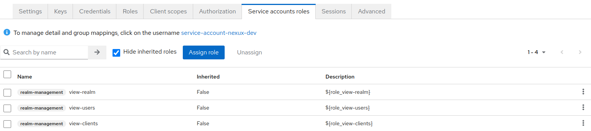
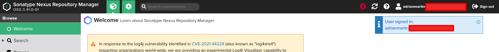

# Nexus
Nexus Repository OSS is an open source repository that supports many artifact formats, including Docker, Java™, and npm. With the Nexus tool integration, pipelines in your toolchain can publish and retrieve versioned apps and their dependencies by using central repositories that are accessible from other environments.

## Requirements
* [Nexus](https://github.com/sonatype/nxrm3-helm-repository/tree/main/nexus-repository-manager)
* [Keycloak Plugin](https://github.com/flytreeleft/nexus3-keycloak-plugin)

## Configuration
First we will need to configure Keycloak. We will assume that we have a new Realm called `Factory`.

### Keycloak - Clients
Create `nexus` user.


Configure `Service account roles`.


#### SA for roles
Assign roles to `nexus` user for view realms, users and clients.


### Keycloak - Groups
Create `nx-admin` group.


### Keycloak - Users
Join user to a `nx-admin` group.


### Nexus
Download Keycloak conection adaptor for client.


The YAML file for the Helm Chart is:
```yaml
image:
  # Bug: https://github.com/sonatype/docker-nexus3/pull/148
  #tag: 3.41.1
  tag: 3.41.0

nexus:
  env:
    - name: INSTALL4J_ADD_VM_PARAMS
      value: |-
        -Xms2703M -Xmx2703M
        -XX:MaxDirectMemorySize=2703M
        -XX:+UnlockExperimentalVMOptions
        -XX:+UseCGroupMemoryLimitForHeap
        -Djava.util.prefs.userRoot=/nexus-data/javaprefs
    - name: NEXUS_SECURITY_RANDOMPASSWORD
      value: "true"
    - name: NEXUS_CONTEXT
      value: "nexus"
      
  readinessProbe:
    path: /nexus

  nexusPort: 8081

deployment:
  initContainers:
    - name: plugin-install
      image: curlimages/curl:latest
      imagePullPolicy: IfNotPresent
      command: 
      - 'wget'
      - '-O'
      - '/opt/sonatype/nexus/deploy/nexus3-keycloak-plugin-0.5.0.jar'
      - 'https://github.com/flytreeleft/nexus3-keycloak-plugin/releases/download/v0.5.0/nexus3-keycloak-plugin-0.5.0.jar'
      volumeMounts:
        - name: deploy
          mountPath: /opt/sonatype/nexus/deploy
      securityContext:
        allowPrivilegeEscalation: true
  additionalVolumes:
    - name: deploy
      emptyDir:
        sizeLimit: 100Mi
  additionalVolumeMounts:
    - name: deploy
      mountPath: /opt/sonatype/nexus/deploy

config:
  enabled: true
  mountPath: "/opt/sonatype/nexus/etc/keycloak.json"
  subPath: keycloak.json
  data:
      ## Set up the keycloak Nexus client configuration
      keycloak.json: |-
          {
            "realm": "factory",
            "auth-server-url": "https://keycloak.<your-domain>/auth/",
            "ssl-required": "external",
            "resource": "nexux",
            "verify-token-audience": true,
            "credentials": {
              "secret": "<secret>"
            },
            "use-resource-role-mappings": true,
            "confidential-port": 0,
            "policy-enforcer": {}
          }

ingress:
  enabled: true
  ingressClassName: nginx
  annotations:
    external-dns.alpha.kubernetes.io/hostname: nexus.<your-domain>
    nginx.ingress.kubernetes.io/proxy-body-size: "0"
    nginx.ingress.kubernetes.io/server-snippet: |
      location ~ ^/(v1|v2)/[^/]+/?[^/]+/blobs/ {
        client_max_body_size 10G;
        if ($request_method ~* (POST|PUT|DELETE|PATCH|HEAD) ) {
          rewrite ^/(.*)$ /nexus/repository/docker-private/$1 last;
        }
        rewrite ^/(.*)$ /nexus/repository/docker-group/$1 last;
      }
      location ~ ^/(v1|v2)/ {
        client_max_body_size 10G;
        if ($request_method ~* (POST|PUT|DELETE|PATCH) ) {
          rewrite ^/(.*)$ /nexus/repository/docker-private/$1 last;
        }
        rewrite ^/(.*)$ /nexus/repository/docker-group/$1 last;
      }
  hostPath: /nexus
  hostRepo: nexus.<your-domain>
```

#### Nexus - Groups
`nx-admin` group already exists.


#### Nexus - Realms
Active `Keycloak Authentication` Realm.


## Login


