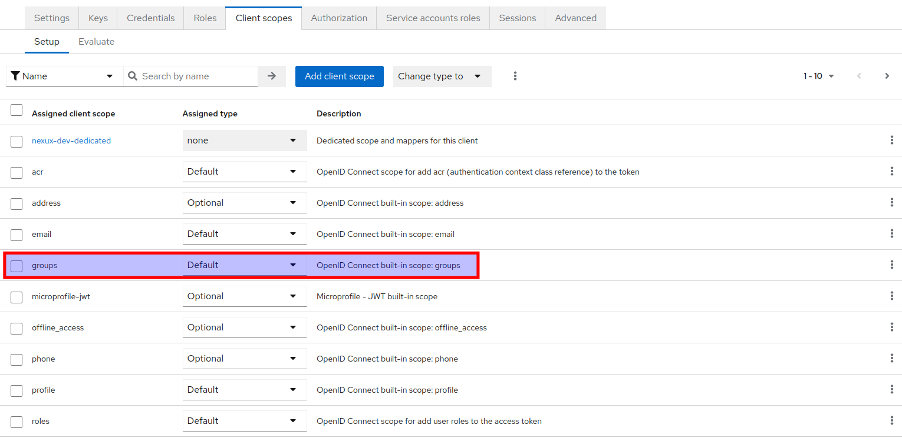
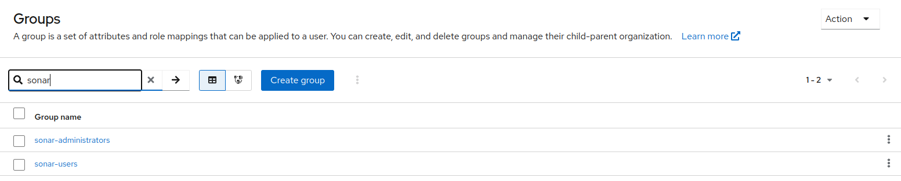
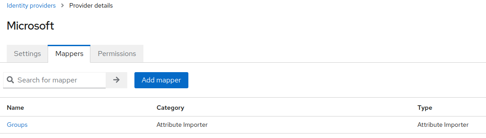
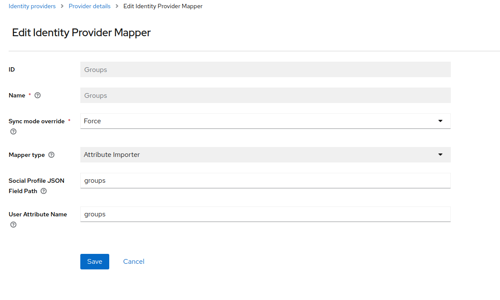

# Sonarqube
SonarQube is an open source platform for continuous code quality inspection through different static source code analysis tools.

## Requirements
* [Sonarqube](https://github.com/SonarSource/helm-chart-sonarqube/tree/master/charts/sonarqube)
* [Plugin](https://github.com/vaulttec/sonar-auth-oidc)

## Configuration
First we will need to configure Keycloak. We will assume that we have a new Realm called `Factory`.

### Keycloak - Clients
Create `sonarqube` user.


#### Client Scope
Declare `Groups` scope.


### Keycloak - Groups
Create `sonar-administrators` and `sonar-users` groups.


### Keycloak - Users
Join user to a `sonar-administrators` group.


### Keycloak - Mappers
Create a `Mapper` for `Groups`.



### Sonarqube
The YAML file for the Helm Chart is:
```yaml
ingress:
  enabled: true
  hosts:
    - name: sonarqube.<your-domain>
      path: /
  annotations:
    external-dns.alpha.kubernetes.io/hostname: sonarqube.<your-domain>
    nginx.ingress.kubernetes.io/proxy-body-size: "8m"
  ingressClassName: nginx

prometheusExporter:
  enabled: false

jdbcOverwrite:  
  enable: false

sonarProperties:
  sonar.core.serverBaseURL: "https://sonarqube.<your-domain>"
  sonar.auth.oidc.enabled: true
  sonar.auth.oidc.issuerUri: "https://keycloak.<your-domain>/auth/realms/factory"
  sonar.auth.oidc.clientId.secured: "sonarqube"
  sonar.auth.oidc.scopes: "openid email profile groups"
  sonar.auth.oidc.groupsSync: true

plugins:
  install:
    - "https://github.com/vaulttec/sonar-auth-oidc/releases/download/v2.1.1/sonar-auth-oidc-plugin-2.1.1.jar"

postgresql:
  enabled: true

account:
    adminPassword: <username>
    currentAdminPassword: <userpassword>
```

#### Sonarqube - Groups
`sonar-administrators` and `sonar-users` groups already exists.


## Login


